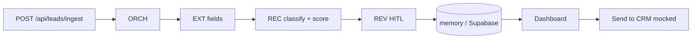

# Helix for Lead Scoring

Reusable Helix vertical: ingest a contact, classify **lead / spam / info**, score 0–100 with confidence, queue mid-confidence rows for human review, mock CRM handoff.

Agents reused from Helix core: **EXT** (fields + confidence), **REC** (classification + score), **REV** (HITL). CRM connectors are intentionally out of this MVP.

## Run locally

From the repo root:

```bash
npm install
npm run dev:leads
```

Open [http://127.0.0.1:43148](http://127.0.0.1:43148).

The demo seeds five sample leads and scores new ones with heuristics if `ANTHROPIC_API_KEY` is missing.

## Env

Copy `apps/lead-scoring/.env.example` to `.env.local`:

| Variable | Required | Purpose |
| --- | --- | --- |
| `ANTHROPIC_API_KEY` | no | Claude JSON scoring; else heuristic |
| `NEXT_PUBLIC_SUPABASE_URL` | no | Persist into schema `lead_scoring` |
| `SUPABASE_SERVICE_ROLE_KEY` | no | Server upsert (bypasses RLS) |

SQL: `supabase/schemas/lead_scoring.sql`. Expose schema `lead_scoring` in the Supabase API settings.

## Architecture



## Deploy (Vercel)

Root directory: `apps/lead-scoring`. Include workspace package `@helix/core` (monorepo). Set the env vars above.
